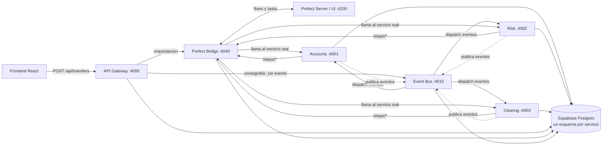

# NovaBank International — Patrón Saga Bancario

Taller: Implementación del Patrón Saga (Orquestación vs. Coreografía) con observabilidad en **Prefect**.

## Miembros: Valentina Ruiz Torres y Darek Aljuri Martinez

## Link video de demostración: https://youtu.be/pPAP9WztEVM

## Documento Comparación: [docs/COMPARATIVA.md](docs/COMPARATIVA.md).

## Arquitectura



- **Frontend** (React + Vite): formulario de transferencia, switches de caos y timeline en vivo.
- **Gateway** (Node/Express): punto de entrada único, idempotencia (UUID) y despacho a orquestación o coreografía.
- **Microservicios de dominio** (Node/Express), cada uno con su **propio esquema** en el mismo proyecto Postgres (Supabase):
  - `accounts` — Cuentas y Saldos (débitos, créditos, reversas, ledger de auditoría).
  - `risk` — Riesgo y Prevención de Fraude (límites diarios, aprobación/anulación).
  - `clearing` — Pasarela Interbancaria (liquidación externa simulada).
- **Event Bus** (Node/Express): relé de publicación/suscripción para la Saga Coreografiada. No contiene lógica de negocio ni decide nada — solo entrega eventos.
- **Prefect Bridge** (Python/FastAPI): aquí vive el **orquestador real** (`saga_orquestada_flow`, un flow de Prefect con una task por paso) y los flows individuales que registran cada reacción de la coreografía en Prefect.
- **Prefect Server**: motor + UI de observabilidad (`http://127.0.0.1:4200`). Todo paso de ambas variantes de la Saga —incluyendo las compensaciones— corre como un flow/task real de Prefect y queda visible ahí, taggeado con el `sagaId`.
- **Base de datos**: Postgres en **Supabase** (nube), un único proyecto con esquemas lógicamente aislados (`accounts`, `risk`, `clearing`, `gateway`, `sagas`). Todo lo demás corre 100% local en Docker.

## Por qué Orquestación y Coreografía comparten el mismo Prefect

- **Orquestada**: el gateway dispara `POST /orchestrate` en el bridge, que ejecuta `saga_orquestada_flow` — **un único flow de Prefect es el coordinador central**: llama explícitamente a cada servicio y, ante un fallo, ejecuta las compensaciones en orden inverso dentro del mismo flow run.
- **Coreografiada**: el gateway solo publica el evento `TransferenciaSolicitada` en el Event Bus. Cada microservicio reacciona de forma autónoma y, para ejecutar su propio paso, llama a un endpoint `/steps/*` del bridge — que corre un **flow de Prefect independiente y aislado** (sin relación entre sí, sin coordinador). Así, aunque no hay orquestador, cada paso sigue siendo trazable en Prefect (filtra por tag `sagaId` + `choreography` en la UI).

## Requisitos

- Docker Desktop
- Una cuenta gratuita de [Supabase](https://supabase.com)

## 1. Crear la base de datos (Supabase)

1. Crea un proyecto nuevo en https://supabase.com/dashboard.
2. Ve a **Project Settings → Database → Connection string → URI** y copia la cadena (modo *Session* o *Direct connection*, puerto `5432`).
3. Copia `.env.example` a `.env` en la raíz del repo y pega tu `DATABASE_URL`:

```bash
cp .env.example .env
```

No necesitas crear tablas manualmente: cada servicio ejecuta `CREATE SCHEMA/TABLE IF NOT EXISTS` al arrancar.

## 2. Levantar todo con Docker Compose

```bash
docker compose up --build
```

Servicios expuestos en tu máquina — **usa siempre `127.0.0.1`, no `localhost`** (ver nota abajo):

| Servicio | URL |
|---|---|
| Frontend | http://127.0.0.1:5173 |
| API Gateway | http://127.0.0.1:4000 |
| Prefect UI | http://127.0.0.1:4200 |
| Prefect Bridge | http://127.0.0.1:4040 |
| Accounts / Risk / Clearing | :4001 / :4002 / :4003 |
| Event Bus | http://127.0.0.1:4010 |

Abre `http://127.0.0.1:5173`, realiza una transferencia y luego abre `http://127.0.0.1:4200` → **Runs** para ver cada paso (y compensación) ejecutándose con su delay real (filtra por el tag = `sagaId` que te muestra el frontend).

> **¿Por qué `127.0.0.1` y no `localhost`?** En Windows con Docker Desktop (backend WSL2), a veces queda un *relay* de puertos obsoleto de una ejecución anterior escuchando solo en `::1` (IPv6). Como `localhost` suele resolver primero a `::1`, el navegador puede terminar hablando con ese proceso viejo en vez del contenedor real, mostrando MIME types raros o "Unable to connect". `127.0.0.1` (IPv4 explícito) siempre apunta al contenedor correcto, sin ambigüedad — por eso el `docker-compose.yml` ya usa `127.0.0.1` de forma fija para las variables internas del frontend y de Prefect, y por eso es la URL recomendada para abrir en el navegador. Si aun así `localhost` no te sirve, reinicia Docker Desktop para limpiar el relay viejo.

## 3. Alternativa sin Docker (desarrollo rápido)

```bash
npm install
npm run dev            # todos los servicios Node + frontend con concurrently
```

Para el bridge de Prefect (Python), en otra terminal:

```bash
cd services/prefect-bridge
python -m venv .venv && .venv\Scripts\activate     # Windows
pip install -r requirements.txt
prefect server start          # deja esta terminal abierta (UI en :4200)
```

Y en otra terminal más (con el venv activado):

```bash
uvicorn app.main:app --port 4040
```

## Casos de prueba (matriz del enunciado)

| ID | Cómo reproducirlo en el frontend |
|---|---|
| CP-01 Camino feliz | Transferencia normal, sin switches activados |
| CP-02 Fondos insuficientes | Importe mayor al saldo mostrado en el panel de Cuentas |
| CP-03 Riesgo/Antifraude | Activa "Forzar rechazo de riesgo" |
| CP-04 Caída de red interbancaria | Activa "Forzar caída de red interbancaria" |
| CP-05 Idempotencia | Botón "Reenviar última operación" tras cualquier envío |

Repite cada caso en ambos modos (Orquestada / Coreografiada) para contrastar.

## Estructura del repositorio

```
packages/common/       utilidades Node compartidas (delay, ids, cliente Postgres)
services/accounts/     microservicio Cuentas y Saldos
services/risk/         microservicio Riesgo y Antifraude
services/clearing/     microservicio Pasarela Interbancaria
services/event-bus/    relé de eventos (coreografía)
services/gateway/      API Gateway
services/prefect-bridge/  orquestador (Prefect) + puente de trazabilidad
frontend/              interfaz React
docs/COMPARATIVA.md    Orquestación vs. Coreografía
docker-compose.yml     despliegue local completo
```

Ver también [docs/COMPARATIVA.md](docs/COMPARATIVA.md).
