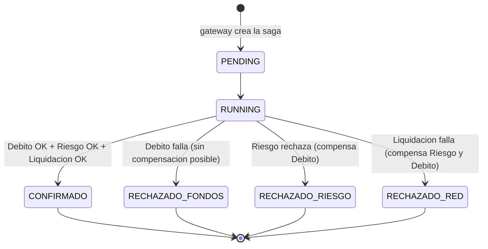
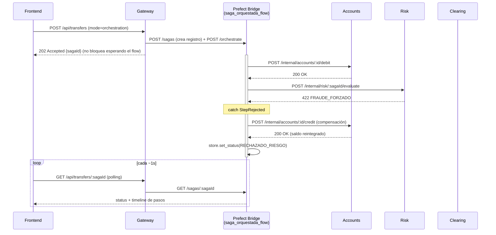
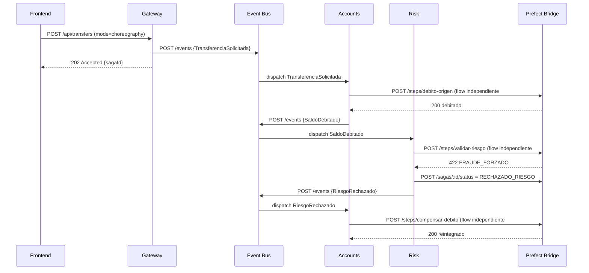

# Patrón Saga Bancario: Fundamentos, Orquestación vs. Coreografía

Este documento explica, de lo conceptual a lo concreto, **por qué** existe el patrón Saga, **cómo** se implementó en este repositorio y **dónde** en el código vive cada pieza.

## 1. Por qué Saga y no 2PC

Un **Two-Phase Commit (2PC)** exige que un coordinador bloquee recursos en *todas* las bases de datos participantes (fase *prepare*) hasta que todas confirmen (fase *commit*). Eso da consistencia fuerte, pero:

- Cualquier participante lento o caído bloquea a todos los demás (locks retenidos).
- El coordinador es un punto único de fallo y de contención.
- No escala bien entre servicios con dueños/infraestructura distintos (justo el caso de "Cuentas", "Riesgo" y "Pasarela Interbancaria": tres dominios que deberían poder evolucionar y fallar de forma independiente).

El patrón **Saga** reemplaza esa transacción distribuida por una **secuencia de transacciones locales** (`T1, T2, ..., Tn`), cada una confirmada de inmediato en su propia base de datos. Si `Tk` falla, en vez de hacer *rollback* de una transacción global (que no existe), se ejecutan **transacciones de compensación** (`Ck-1, ..., C1`) que deshacen semánticamente el efecto de los pasos que sí tuvieron éxito. Esto es el modelo **BASE**:

| | ACID (2PC) | BASE (Saga) |
|---|---|---|
| Disponibilidad | Baja bajo fallos (bloqueo global) | **B**asically Available — cada paso sigue local, sin bloqueo global |
| Estado | Todo o nada, inmediato | **S**oft state — mientras la saga corre, el sistema está en un estado intermedio válido pero no final |
| Consistencia | Fuerte e inmediata | **E**ventual — se llega al estado final correcto (confirmado o totalmente revertido) al terminar la saga |

En este proyecto, la propiedad que se garantiza (y se verifica en los 5 casos de prueba) es: **nunca queda dinero debitado sin su contraparte** — o se completa la transferencia de punta a punta, o se revierte por completo.

## 2. Máquina de estados de una Saga

Cada saga (identificada por `sagaId`, un UUID) transita por estos estados (`SAGA_STATUS` en [`packages/common/index.js`](../packages/common/index.js)):



Y cada **paso individual** dentro de la saga tiene su propio ciclo de vida (`STEP_STATE`): `RUNNING → SUCCESS` (camino feliz) o `RUNNING → FAILED → COMPENSATING → COMPENSATED` (camino de reversa). Este es el ciclo que ves en vivo en el frontend y como estados de flow/task en Prefect.

## 3. La regla de oro: compensar en orden estrictamente inverso

Si la saga ejecutó pasos en el orden `1 (Débito) → 2 (Riesgo) → 3 (Liquidación)` y falla el paso 3, **no basta con deshacer el paso 3** (no tiene compensación propia porque nunca llegó a tener éxito): hay que deshacer, en orden inverso, todo lo que sí tuvo éxito antes: primero anular la aprobación de riesgo (2), *después* reintegrar el débito (1). Deshacerlo en el orden equivocado (o en paralelo sin orden) podría dejar estados intermedios inconsistentes si un paso posterior asumía que uno anterior seguía vigente.

Así se ve literalmente en el código del orquestador ([`services/prefect-bridge/app/flows.py`](../services/prefect-bridge/app/flows.py), función `saga_orquestada_flow`, líneas ~60-77):

```python
except StepRejected as err:
    await store.add_step(saga_id, LIQUIDACION_INTERBANCARIA, "FAILED", err.body)
    logger.warning("Fallo de red interbancaria -> compensando en orden inverso (riesgo, luego debito)")

    await store.add_step(saga_id, COMPENSACION_RIESGO, "COMPENSATING")
    comp1 = await t_compensar_riesgo(saga_id)                      # deshace el paso 2
    await store.add_step(saga_id, COMPENSACION_RIESGO, "COMPENSATED", comp1)

    await store.add_step(saga_id, COMPENSACION_DEBITO, "COMPENSATING")
    comp2 = await t_compensar_debito(origin_account_id, amount_cents, saga_id)  # deshace el paso 1
    await store.add_step(saga_id, COMPENSACION_DEBITO, "COMPENSATED", comp2)

    await store.set_status(saga_id, "RECHAZADO_RED", err.body)
```

Nótese que si en cambio falla el paso 2 (Riesgo), solo se compensa el paso 1 (no existe nada del paso 3 que compensar, porque nunca se ejecutó) — la cantidad de compensaciones siempre es exactamente "los pasos previos que tuvieron éxito", en reversa.

## 4. Orquestación: cómo funciona paso a paso

Un **único flow de Prefect** (`saga_orquestada_flow`) es el coordinador central: sabe la secuencia completa, llama explícitamente a cada servicio y decide las compensaciones.



**Mapa de código:**

| Paso | Dónde vive |
|---|---|
| Frontend dispara la transferencia | [`frontend/src/App.jsx`](../frontend/src/App.jsx) → `postTransfer` |
| Gateway crea el `sagaId`, registra idempotencia y dispara el flow | [`services/gateway/src/index.js`](../services/gateway/src/index.js) → `POST /api/transfers` |
| El flow se ejecuta en segundo plano (no bloquea al gateway) | [`services/prefect-bridge/app/main.py`](../services/prefect-bridge/app/main.py) → `POST /orchestrate` con `BackgroundTasks` |
| El coordinador real (secuencia + decisión de compensar) | [`services/prefect-bridge/app/flows.py`](../services/prefect-bridge/app/flows.py) → `saga_orquestada_flow` |
| Cada llamada HTTP a un microservicio, como `@task` de Prefect (visible con su duración real en la UI) | [`services/prefect-bridge/app/tasks.py`](../services/prefect-bridge/app/tasks.py) → `t_debitar_origen`, `t_validar_riesgo`, `t_liquidar_interbancaria`, `t_compensar_riesgo`, `t_compensar_debito` |
| Lógica de negocio real + delay simulado + idempotencia interna | `services/accounts/src/index.js`, `services/risk/src/index.js`, `services/clearing/src/index.js` |

## 5. Coreografía: cómo funciona paso a paso

**No existe un coordinador.** Cada microservicio reacciona a un evento, ejecuta su paso y decide autónomamente qué evento publicar después. La secuencia completa *emerge* de las suscripciones, no está escrita en ningún lugar como un todo.



Nótese que **cada llamada a `/steps/*` es su propio flow de Prefect**, sin relación entre sí — por eso en la UI de Prefect una saga coreografiada aparece como **varios flow-runs sueltos** (uno por paso), en vez de un único run como en orquestación. Es el comportamiento correcto y esperado: se reconstruyen filtrando por el tag `sagaId` en la pestaña *Runs*.

**El contrato de eventos completo** ([`services/event-bus/src/index.js`](../services/event-bus/src/index.js), objeto `SUBSCRIPTIONS`):

```
TransferenciaSolicitada  → Accounts   → (éxito) SaldoDebitado   / (fallo) DebitoRechazado
SaldoDebitado             → Risk       → (éxito) RiesgoAprobado  / (fallo) RiesgoRechazado
RiesgoAprobado            → Clearing   → (éxito) TransferenciaConfirmada / (fallo) TransferenciaFallida
RiesgoRechazado           → Accounts   → compensa el débito
TransferenciaFallida(RED) → Accounts   → compensa el débito
TransferenciaFallida(RED) → Risk       → anula la aprobación de riesgo
```

El Event Bus es deliberadamente "tonto": un mapa estático `evento → suscriptores` que reenvía por HTTP (`dispatch()`), sin lógica de negocio ni conocimiento del estado de la saga — si mañana se agrega un cuarto microservicio que reacciona a `SaldoDebitado`, solo se agrega su URL a esa lista, sin tocar a Accounts, Risk ni Clearing.

**¿Quién decide el estado final si nadie ve la saga completa?** El servicio que detecta la condición terminal la reporta él mismo: `Accounts` reporta `RECHAZADO_FONDOS` si el débito falla, `Risk` reporta `RECHAZADO_RIESGO` si rechaza, `Clearing` reporta `RECHAZADO_RED` o `CONFIRMADO` según el resultado de la liquidación (ver la llamada `reportSagaStatus` en cada `/events/handle`). Sigue sin haber coordinador: cada uno solo informa lo que él mismo concluyó.

## 6. Idempotencia (CP-05): el patrón "claim-then-execute"

El mecanismo vive en [`packages/common/db.js`](../packages/common/db.js), función `runIdempotent(pool, table, key, worker)`, y se usa en **dos capas**:

1. **Nivel transferencia** (`gateway.idempotency`, clave = `idempotencyKey` que envía el cliente): evita que reenviar el mismo formulario dispare una segunda saga completa.
2. **Nivel paso** (`accounts.idempotency`, `risk.idempotency`, `clearing.idempotency`, clave = `` `${sagaId}:operacion` ``): protege cada micro-paso individualmente, incluso si un mensaje de evento se reintentara o un flow se re-ejecutara.

El patrón es un *"reclamar antes de ejecutar"* atómico:

```js
const claim = await pool.query(
  `INSERT INTO ${table} (key, response, status_code) VALUES ($1, '{}'::jsonb, 0) ON CONFLICT (key) DO NOTHING`,
  [key],
);
if (claim.rowCount === 0) {
  // Alguien ya reclamo esta clave antes: se devuelve la respuesta YA GUARDADA,
  // sin volver a ejecutar el efecto (sin doble debito).
  const existing = await pool.query(`SELECT response, status_code FROM ${table} WHERE key = $1`, [key]);
  return { cached: true, ... };
}
// Primera vez que se ve esta clave: se ejecuta el efecto real y se guarda el resultado.
const result = await worker();
await pool.query(`UPDATE ${table} SET response = $2, status_code = $3 WHERE key = $1`, [key, result.body, result.statusCode]);
return { cached: false, ... };
```

El `INSERT ... ON CONFLICT DO NOTHING` es atómico a nivel de base de datos: si dos requests con la misma clave llegan casi al mismo tiempo, solo uno consigue insertar la fila (gana la carrera) y el otro recibe `rowCount === 0`, garantizando que el `worker()` (el efecto real: debitar, publicar el evento inicial, etc.) se ejecute **como máximo una vez** por clave.

## 7. Comparativa lado a lado

| | Saga Orquestada | Saga Coreografiada |
|---|---|---|
| Coordinador | Sí — `saga_orquestada_flow` (Prefect) | No existe. Cada servicio decide por sí mismo. |
| Quién conoce el flujo completo | El flow de Prefect (`services/prefect-bridge/app/flows.py`) | Nadie: cada servicio solo conoce los eventos a los que reacciona |
| Acoplamiento | Alto acoplamiento temporal al orquestador; bajo acoplamiento entre servicios entre sí (nunca se llaman directamente) | Bajo acoplamiento: los servicios ni siquiera saben cuáles otros existen, solo el contrato de eventos |
| Cómo se dispara una compensación | El flow captura la excepción del paso fallido y llama explícitamente a las tasks de compensación en orden inverso | El servicio que detecta el fallo publica un evento (`RiesgoRechazado`, `TransferenciaFallida`); los demás se suscriben a ese evento y compensan por su cuenta |
| Visibilidad del flujo completo | Un solo flow run en Prefect con el árbol completo de tasks | Varios flow runs independientes en Prefect, correlacionados solo por el tag `sagaId` |
| Punto único de fallo | El propio orquestador (si cae, ninguna saga nueva avanza) | Ninguno — el Event Bus es solo un relé; si un servicio cae, solo se detienen las sagas que dependían de él |
| Facilidad para añadir un paso nuevo | Editar el flow (un solo archivo) | Publicar el nuevo evento y suscribir al servicio interesado, sin tocar a los demás |
| Quién decide el estado final de la saga | El flow, al final de su propia ejecución | El servicio que detecta la condición terminal (ver sección 5) |

## 8. Mapa de código (referencia rápida)

| Concepto | Archivo |
|---|---|
| Estados de saga y de paso (constantes compartidas) | [`packages/common/index.js`](../packages/common/index.js) |
| Cliente Postgres + patrón de idempotencia | [`packages/common/db.js`](../packages/common/db.js) |
| Punto de entrada único + idempotencia de transferencia | [`services/gateway/src/index.js`](../services/gateway/src/index.js) |
| Coordinador de la Saga Orquestada | [`services/prefect-bridge/app/flows.py`](../services/prefect-bridge/app/flows.py) → `saga_orquestada_flow` |
| Flows individuales de cada paso coreografiado | [`services/prefect-bridge/app/flows.py`](../services/prefect-bridge/app/flows.py) → `choreo_*` |
| Tasks de Prefect (llamadas HTTP a los microservicios) | [`services/prefect-bridge/app/tasks.py`](../services/prefect-bridge/app/tasks.py) |
| API REST del bridge (trigger de orquestación, endpoints `/steps/*`, estado de sagas) | [`services/prefect-bridge/app/main.py`](../services/prefect-bridge/app/main.py) |
| Relé de eventos + contrato evento→suscriptores | [`services/event-bus/src/index.js`](../services/event-bus/src/index.js) |
| Débito / crédito / ledger de auditoría | [`services/accounts/src/index.js`](../services/accounts/src/index.js) |
| Evaluación y anulación de riesgo | [`services/risk/src/index.js`](../services/risk/src/index.js) |
| Liquidación interbancaria simulada | [`services/clearing/src/index.js`](../services/clearing/src/index.js) |
| Timeline en vivo + banner de idempotencia (CP-05) | [`frontend/src/App.jsx`](../frontend/src/App.jsx) |

## 9. Conclusión

Ambas variantes garantizan la misma propiedad de negocio (consistencia eventual, sin dinero perdido ni estados en limbo), pero con trade-offs opuestos: la orquestación centraliza el conocimiento del flujo (más fácil de auditar y depurar, pero crea un punto único de coordinación), mientras que la coreografía lo distribuye (más resiliente y desacoplada, pero más difícil de razonar como un todo — por eso la trazabilidad vía Prefect, taggeada por `sagaId`, es tan importante en este modelo). La idempotencia de dos capas y la regla de compensar en orden estrictamente inverso son las dos garantías que hacen que, en cualquiera de los dos modos, el sistema nunca deje una transferencia a medias.
